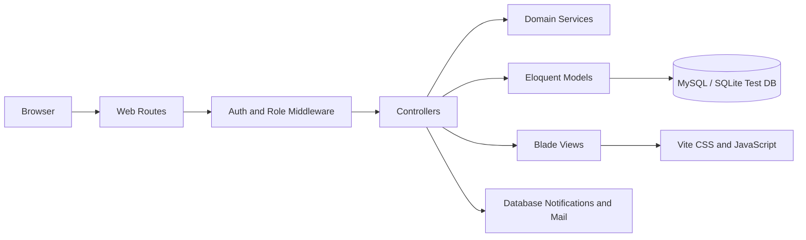
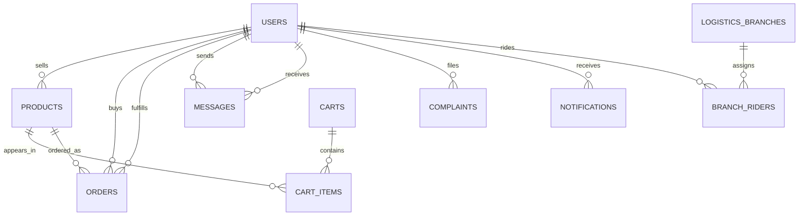
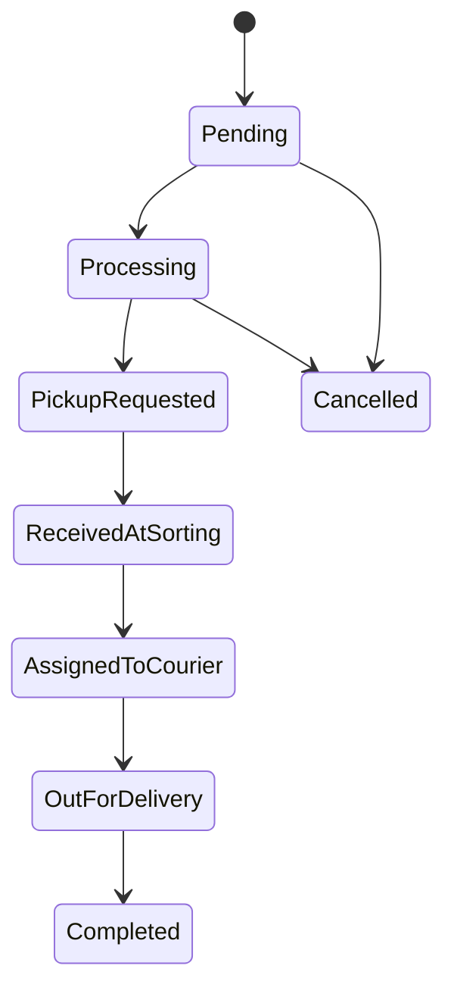

# PLAN-02: Backend Architecture, Database, API, Security, and QA

**Prepared for:** Justin Paul M. Plantilla  
**System:** PickSell Marketplace and PickSell Logistics  
**Document status:** Draft for review  
**Scope:** Sections 2, 4, and 7

---

## Section 2. System Architecture and Database

### 2.1 Backend Architecture

PickSell uses a Laravel MVC architecture with server-rendered Blade views and a Vite-built frontend asset layer. The backend is organized around Laravel controllers, Eloquent models, middleware, notifications, mail, migrations, and route groups.

The application supports several role-based portals:

- Buyer marketplace and order management
- Seller inventory, order fulfillment, and reports
- Courier delivery tasks and account management
- Logistics sorting center, branches, rider assignment, and tracking
- Admin moderation, user management, reports, platform settings, and support

The main request flow is:



`routes/web.php` is the primary application boundary. Public routes handle marketplace pages and authentication. Authenticated routes are grouped by role and protected by middleware such as `AdminMiddleware`, `BuyerMiddleware`, `SellerMiddleware`, `CourierMiddleware`, and `LogisticsMiddleware`.

Business logic is primarily coordinated by controllers and Eloquent relationships. Logistics routing is isolated in `App\Services\LogisticsRoutingService`, which is the preferred location for delivery-area and branch-routing rules that should not be duplicated in controllers.

### 2.2 Main Backend Components

| Component | Responsibility |
|---|---|
| Controllers | Validate requests, authorize role-specific actions, coordinate models and responses |
| Middleware | Enforce authentication and role access boundaries |
| Eloquent models | Represent users, products, orders, carts, messages, complaints, logistics, and settings |
| Migrations | Version and document database schema changes |
| Notifications | Persist user-facing events such as order, moderation, complaint, and delivery updates |
| Mail classes | Send registration, status, warning, and message-related email notifications |
| Services | Encapsulate cross-controller domain logic, especially logistics routing |
| Blade layouts | Provide separate admin, buyer, seller, courier, and logistics UI shells |
| Vite assets | Build page-specific CSS and JavaScript without placing application behavior in inline blocks |
| PHPUnit | Provide unit and feature-level verification using an in-memory SQLite database |

### 2.3 Database Schema Overview

The database is relational. Users are the central identity entity, while products, carts, orders, messages, complaints, notifications, and logistics records connect through foreign keys and role-aware relationships.

Core entities:

- `users`: identity, role, status, contact information, location, and role-specific profile fields
- `products`: seller-owned products, category, price, stock, status, image, and featured state
- `orders`: buyer purchases, seller fulfillment, logistics provider, courier assignment, tracking, and financial values
- `carts` and `cart_items`: buyer shopping state before checkout
- `messages`: user-to-user conversations and optional product context
- `complaints`: filed issues, involved users, status, and resolution information
- `notifications`: Laravel database notifications with `read_at` timestamps
- `announcements`: platform messages targeted to selected audiences
- `platform_settings`: persisted administrative configuration
- Logistics network tables: branches, barangay coverage, rider assignments, and related location mappings

### 2.4 Relationship Model



### 2.5 Database Schema Refinement Plan

The current migration history is functional, but the following refinements should be applied or verified before production certification:

1. **Foreign-key integrity**
   - Add or verify foreign keys for buyer, seller, courier, logistics provider, product, branch, municipality, and barangay references.
   - Define explicit delete behavior. Historical orders, complaints, messages, and notifications should normally be preserved rather than cascaded away.

2. **Indexes for operational queries**
   - Add indexes on `users.role`, `users.status`, and `users.email`.
   - Add indexes on `products.seller_id`, `products.status`, `products.category`, and `products.is_featured`.
   - Add indexes on order status, tracking status, buyer, seller, courier, logistics provider, and created date.
   - Add a composite index on notification recipient and `read_at` for unread-count queries.

3. **Consistent status values**
   - Keep status values documented in one place and validate them at the request boundary.
   - Prefer PHP enums or centralized constants for user, product, order, application, and complaint statuses when the supported PHP version and migration strategy allow it.

4. **Money and quantity fields**
   - Store prices, commissions, totals, and shipping values using fixed-precision decimal columns rather than floating-point values.
   - Use non-negative constraints or request validation for price, stock, quantity, and commission inputs.

5. **Auditability**
   - Preserve timestamps for status changes such as seller confirmation, pickup approval, scanning, assignment, and delivery completion.
   - Add an audit/event record for high-impact administrative actions such as account suspension, product archival, commission changes, and platform setting updates.

6. **Sensitive data separation**
   - Keep passwords, uploaded identity documents, and business permits out of public storage paths.
   - Store only the required file path and metadata in the database, with authorization checks before download.

### 2.6 Transaction Boundaries

Checkout, order status transitions, stock updates, and logistics assignment should run inside database transactions. A transaction should include all writes that must succeed or fail together. For example, placing an order should validate stock, create the order and order items, decrement stock, and clear the cart atomically.

Notifications and email delivery should be dispatched after the database transaction commits. This prevents users from receiving a success message for a transaction that later rolls back.

---

## Section 4. API and Backend Rules

### 4.1 API Style

The current system is primarily a Laravel web application using named routes, form submissions, redirects, Blade responses, and selected JSON endpoints. Notification endpoints return JSON for dashboard polling. This is acceptable for the current scope, but API endpoints should follow consistent response and authorization rules.

Recommended response conventions:

| Situation | Response |
|---|---|
| Successful page form | Redirect to a named route with a flash message |
| Successful JSON request | HTTP 200 or 201 with a stable JSON object |
| Validation failure | HTTP 422 for JSON; redirect with validation errors for Blade forms |
| Unauthenticated request | HTTP 401 for JSON; redirect to login for web pages |
| Authenticated but wrong role | HTTP 403 |
| Missing record | HTTP 404 |
| Conflict, such as invalid status transition | HTTP 409 or a documented validation error |

### 4.2 Route and Authorization Rules

1. Every protected route must be inside the `auth` middleware group.
2. Every role-specific route must also use its matching role middleware.
3. Controllers must not trust a role, user ID, seller ID, buyer ID, or status supplied by the browser.
4. Resource ownership must be checked server-side before reading or mutating a record.
5. State transitions must be allow-listed. A client must not be able to submit arbitrary status values.
6. Use named routes for internal links and form targets where practical.
7. Keep JSON endpoints role-scoped. For example, `/admin/notifications` must never return another user's notifications.
8. Use POST, PATCH, or DELETE for mutations. Do not mutate data through GET requests.
9. Use CSRF protection for all browser form and fetch mutations.
10. Return only the fields needed by the client. Do not expose password hashes, private document paths, or unrelated profile data.

### 4.3 Validation Rules

Requests should use Laravel validation before any database mutation. Validation should cover:

- Email format and uniqueness where applicable
- Password minimum length and confirmation
- Contact-number format
- Uploaded file MIME type and maximum size
- Positive price, stock, quantity, commission, and order values
- Allowed role, audience, status, and provider-type values
- Ownership and existence of referenced products, orders, users, branches, and locations

Validation messages should be user-readable, while server logs should contain enough context to diagnose failures without recording passwords or sensitive documents.

### 4.4 Order and Logistics Rules

Order status transitions must be explicit and sequential. A recommended transition policy is:



The backend must verify the actor and current state before each transition. Seller, courier, logistics, buyer, and admin actions should not share unrestricted update methods.

Stock should be checked again at checkout time. Product status, seller status, and buyer authorization should be revalidated on the server even if the UI already hides invalid actions.

### 4.5 Notifications and Read State

Notifications are stored through Laravel's database notification system. The notification list endpoint returns the user's notifications and an unread count. The dedicated `POST /notifications/read` role endpoint marks the authenticated user's unread notifications as read.

The backend rule is:

- Fetching notifications must not change read state.
- Marking notifications read must be an explicit authenticated mutation.
- A user may only mark their own notifications as read.
- The client may display the unread count but must not calculate authorization or business state from it.

### 4.6 Error Handling and Logging

Production responses should avoid exposing stack traces, SQL statements, credentials, or filesystem paths. Application logs should record the route, authenticated user ID, role, operation, and failure category when safe to do so. Request payloads must be filtered to exclude passwords, tokens, uploaded documents, and mail credentials.

---

## Section 7. QA Strategy

### 7.1 Test Layers

| Layer | Purpose | Examples |
|---|---|---|
| Unit tests | Verify isolated domain rules and services | Logistics routing, status transition rules, price calculations |
| Feature tests | Verify routes, middleware, validation, database writes, and responses | Login, role access, checkout, moderation, notifications |
| Integration tests | Verify connected workflows across models and services | Order-to-logistics assignment, seller handover, courier completion |
| Browser/UI checks | Verify layout, interaction, responsive behavior, and compiled assets | Auth layouts, dashboard menus, notification cards, action buttons |
| Regression checks | Protect previously fixed layout and refactor issues | Blade document order, extracted CSS/JS loading, SVG-only admin actions |

The existing PHPUnit configuration uses an in-memory SQLite database for tests, array sessions/cache, synchronous queues, and array mail. This keeps automated tests isolated and repeatable.

### 7.2 Functional Test Matrix

#### Authentication and authorization

- Valid users can log in through the correct portal.
- Invalid credentials are rejected without revealing whether an email exists.
- Pending, suspended, disapproved, and deactivated accounts follow the intended access rules.
- Buyer, seller, courier, logistics, and admin users cannot access another role's protected routes.
- Logout invalidates the session and redirects safely.

#### Buyer and checkout

- Products cannot be purchased when inactive or out of stock.
- Cart quantities cannot exceed stock.
- Checkout creates the expected order and clears the cart atomically.
- Invalid logistics-provider selections are rejected.
- Buyer order history displays only the authenticated buyer's records.

#### Seller operations

- Sellers can manage only their own products and orders.
- Product validation rejects invalid price, stock, image, and category data.
- Seller handover and delivery confirmation require the correct current order state.
- Seller reports calculate totals from authorized seller data only.

#### Courier and logistics

- Couriers see only assigned delivery work.
- Logistics staff can approve, scan, sort, and assign only valid parcels.
- Branch coverage and rider assignment rules are enforced server-side.
- Invalid delivery state transitions are rejected and logged.

#### Admin operations

- Admin-only moderation actions require admin middleware.
- Product feature/archive actions affect only the selected product.
- User activation, suspension, and deactivation are validated and auditable.
- Reports and exports respect date filters and do not expose unauthorized data.
- Platform settings and announcements validate audience and content.

#### Notifications

- Notification lists return only the authenticated user's notifications.
- Unread count is correct before and after marking all notifications read.
- The Mark all as read action is CSRF-protected and idempotent.
- Clicking a notification opens the expected detail card without executing notification text as HTML.

### 7.3 Security Test Plan

- Verify CSRF rejection for browser mutations without a valid token.
- Verify IDOR resistance by changing route IDs to another user's product, order, message, complaint, or account.
- Verify role middleware on every dashboard route.
- Verify uploaded file type, size, storage location, and download authorization.
- Verify output escaping for product names, announcements, messages, complaint text, and notification content.
- Verify rate limiting or abuse controls for login, password reset, contact, and message endpoints.
- Verify production configuration does not expose debug output or secrets.
- Scan dependencies regularly and rotate credentials if they have appeared in source, logs, screenshots, or public repositories.

### 7.4 Performance and Reliability Checks

- Use eager loading for seller, buyer, product, branch, and location relationships used in tables.
- Check notification, order, product, and user queries with realistic record counts.
- Confirm pagination is used for administrative tables and reports.
- Confirm long-running email, export, and notification work can be queued where appropriate.
- Verify database backups and restore procedures before production deployment.
- Test the application with production-like MySQL settings in addition to SQLite feature tests.

### 7.5 Release Gate

A release is ready only when:

1. `php artisan test` passes.
2. `php artisan view:cache` passes.
3. `npm run build` passes.
4. Role and authorization feature tests pass.
5. Critical workflows pass manually or through browser automation.
6. No new PHP, Blade, JavaScript, or CSS diagnostics are present.
7. Database migrations run successfully on a clean test database.
8. Production secrets are stored outside committed files and debug mode is disabled.
9. The deployment smoke test covers login, dashboard access, checkout or order handling, notification read state, and logout.

### 7.6 Evidence to Attach to the Plan

For the final submission, attach:

- A route list showing protected role groups
- A migration/schema diagram or ERD
- PHPUnit output and test count
- Screenshots of each role dashboard and key workflows
- A short security checklist with completed controls
- A deployment smoke-test record with date, environment, and result

---

## Implementation Notes and Open Decisions

- The current application is web-route and Blade oriented; a versioned public REST API can be introduced later if mobile or third-party clients become a requirement.
- The database refinement items above are recommendations to verify against the final migration state before production sign-off.
- The notification read endpoint is intentionally explicit so opening a notification list does not silently change user state.
- This draft describes the current PickSell implementation and the controls required to make it production-ready; it should be reviewed by the project adviser before being marked final.

## Screenshot Evidence Plan

For executable backend proof and captured terminal evidence, see [PLAN-02 Backend Evidence](PLAN-02-backend-evidence.md).

The following screenshots should be captured from the authenticated application and stored in `docs/screenshots/`. The filenames and captions below are ready to use in the final submission.

### Section 2 Evidence

**Figure 1. Role-based system dashboards**  
Files: `admin-dashboard.png`, `seller-dashboard.png`, `logistics-dashboard.png`  
Purpose: Demonstrates the separate role-based portals described in the system architecture.

**Figure 2. Database and migration evidence**  
File: `database-migrations.png`  
Purpose: Shows the migration files or database diagram supporting users, products, orders, messages, notifications, and logistics tables.

### Section 4 Evidence

**Figure 3. Protected route and role workflow**  
File: `role-workflow.png`  
Purpose: Shows an authenticated dashboard with the role-specific navigation and route boundary.

**Figure 4. Notification and read-state workflow**  
File: `notification-detail.png`  
Purpose: Shows the notification dropdown, unread indicator, Mark all as read action, and notification detail card.

### Section 7 Evidence

**Figure 5. Administrative moderation workflow**  
Files: `admin-products.png`, `admin-users.png`, `admin-compliance.png`  
Purpose: Demonstrates product curation, account status actions, and seller compliance actions used in QA scenarios.

**Figure 6. Test and release evidence**  
File: `test-results.png`  
Purpose: Shows the PHPUnit result and, where applicable, the successful frontend build and Blade compilation output.

### Markdown Embed Format

After the images are saved, embed them with captions like this:

```markdown


*Figure 1. Admin dashboard showing the role-based portal and protected navigation.*
```

The authenticated screenshots should avoid exposing passwords, email credentials, database credentials, private identity documents, or personally unnecessary user information. Crop or blur sensitive values before including them in the final document.
